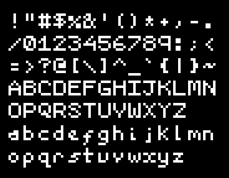

# Bitcast
 _Small, fast, and simple bitmap fonts in single-file C headers_

These are not intended as a replacement for fancy user fonts.
I see them being useful for quickly getting up debug text on a PC, or for embedded developers with limited memory.

## Contents
- [bitcast16](#bitcast16)
- [bitcast32](#bitcast32)
- [API](#api)
	- [Functions](#functions)
	- [Constants](#constants)
	- [Types](#types)
- [How it works](#how-it-works)
- [Recommended Libraries](#recommended-libraries)

## bitcast16


## bitcast32


## API
_Replace the prefix if using a different font._

### Functions
``` c
/* Draw strings into a uint-based pixel buffer. Overwrites any pixels drawn to (no transparency). */
bitcast16_String(unsigned int *Buffer, int RowStride, char *String, int StartX, int StartY, int Scale, unsigned int Col)
/* Buffer         - the array of pixels that you're drawing into.
 * Rowstride      - the number of pixels you have to traverse in the buffer to move
 *                  down one row. Negate the value if your buffer's y is 0 at the bottom.
 * String         - the text you want to draw on the screen.
 * StartX, StartY - the x and y coordinates on the buffer for the top of the character.
 * Scale          - simple integer scaling of glyph 'pixels' to buffer pixels.
 *                  e.g. a value of 3 would draw a 3x3 square for each 'pixel'.
 * Col            - colour value, assuming it can be represented as a uint.
 *                  Could be AARRGGBB, RRGGBBAA or any other formation.
 */

/* Draw characters into a uint-based pixel buffer. Overwrites any pixels drawn to (no transparency). */
bitcast16_Char(unsigned int *Buffer, int RowStride, int DrawDir, char c, unsigned int Value, int xoffset, int yoffset, unsigned int PixelW, unsigned int PixelH)
/* Buffer           - the array of pixels that you're drawing into.
 * Rowstride        - the number of pixels you have to traverse in the buffer to move
 *                    down one row. Negate the value if your buffer's y is 0 at the bottom.
 * DrawDir          - 1 if buffer draws top-down, -1 if drawing bottom-up.
 * String           - the text you want to draw on the screen.
 * xoffset, yoffset - the x and y coordinates on the buffer for the top of the character.
 * PixelW, PixelH   - simple integer scaling of glyph 'pixels' to buffer pixels (in each dimension).
 *                    e.g. value of 3 & 4 would draw a 3x4 rectangle for each 'pixel'.
 * Value            - colour value, assuming it can be represented as a uint.
 *                    Could be AARRGGBB, RRGGBBAA or any other formation.
 */

/* Convert between ASCII number (or character literals) and the associated glyph index. */
bitcast_IndexFromASCII(unsigned int ascii);
bitcast_ASCIIFromIndex(unsigned int index);
```

### Constants
``` c
                          /* (all dimensions in glyph pixels)                    */
BITCAST16_WIDTH           /* Width of glyphs                                     */
BITCAST16_HEIGHT          /* Height of glyphs                                    */
BITCAST16_STRIDE          /* Distance between start of 1 character and the next  */
BITCAST16_MAX_DESCENDER   /* Maximum distance of descenders below baseline       */
BITCAST16_BASELINE_OFFSET /* Distance between baseline and top of next character */
BITCAST16_ROW_ADVANCE     /* Distance between baseline of 1 row and the next     */
```

### Types
``` c
typedef unsigned short bitcast16_glyph;
```

## How it works 
1) Draw the bitmap for a glyph in your text editor, using characters that represent pixels being on ('#'), or off (' ').
(You can better see what the end result will be with a square font)
``` c
/* ASCII: 49, Char: '1', Name: One */
char Glyph_One[] =
/*        012 */
/* 0 */  " # "
/* 1 */  "## "
/* 2 */  " # "
/* 3 */  " # "
/* 4 */  "###";
```
2) This is treated by C as a single linear string...
``` c
" # ##  #  # ###"
```
...which can be easily translated to bits by treating spaces as 0s and #s as 1s.
(This is reversed because I found it slightly more convenient that way round.)
``` c
 111010010011010
```
3) This can then be represented as a number (in hexadecimal)
``` c
0x749a
```
4) Collect a lot of these into an array, sorted in the ASCII code order (omitting the non-printable characters, starting with space at ASCII code 32).
``` c
typedef unsigned short bitcast16_glyph;

bitcast16_glyph bitcast16_Glyphs[95] = {
0x0000,0x2092,0x002d,0x5f7d,0x279e,0x52a5,0x7ad6,0x0012,
0x4494,0x1491,0x017a,0x05d0,0x1400,0x01c0,0x0400,0x12a4,
0x2b6a,0x749a,0x752a,0x38a3,0x4f4a,0x38cf,0x3bce,0x12a7,
0x3aae,0x49ae,0x0410,0x1410,0x4454,0x0e38,0x1511,0x10e3,
0x73ee,0x5f7a,0x3beb,0x624e,0x3b6b,0x73cf,0x13cf,0x6b4e,
0x5bed,0x7497,0x2b27,0x5add,0x7249,0x5b7d,0x5b6b,0x3b6e,
0x12eb,0x4f6b,0x5aeb,0x388e,0x2497,0x6b6d,0x256d,0x5f6d,
0x5aad,0x24ad,0x72a7,0x6496,0x4889,0x3493,0x002a,0xf000,
0x0011,0x6b98,0x3b79,0x7270,0x7b74,0x6750,0x95d6,0xb9ee,
0x5b59,0x6410,0xb482,0x56e8,0x6492,0x5be8,0x5b58,0x3b70,
0x976a,0xcd6a,0x1370,0x38f0,0x64ba,0x3b68,0x2568,0x5f68,
0x54a8,0xb9ad,0x73b8,0x64d6,0x2492,0x3593,0x03e0,
};

```
6) TADAA! We have a font.
7) Extra fanciness - eagle-eyed readers may have noticed that I'm only using 15 of the 16 available bytes in the example.
The 16th is set as a flag for shifting the character's pixel grid down, to allow for descenders without a larger glyph type size.
Depending on the glyph type and aspect ratio, there may be no space for such a flag, or for multiple (e.g. 0-3 descender levels for a 32-bit glyph: `(5 * 6) % 32 == 2; 1 << 2 == 4;`)

## Recommended Libraries
- [sweet](https://github.com/azmr/sweet) (my single-header test suite)
- [live_edit](https://github.com/azmr/live_edit) (my single-header C library-loading/tweaking/debugging/profiling tools)
- [STB libraries](https://github.com/nothings/stb) (lots of excellent single-header libraries, including `stb_truetype.h` for when you want proper fonts)
